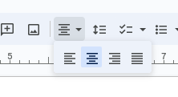
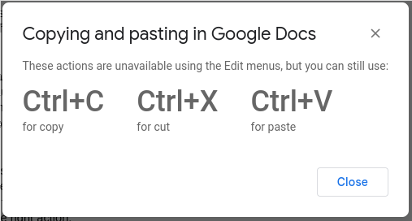
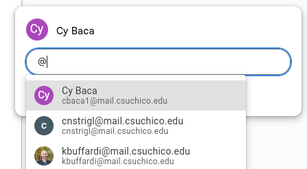

# Writing a Resume

## By Cy Baca
## October 13th 2023

I decided to use [Google Docs](https://www.google.com/docs/about/), a type of word processing software, to write my resume from scratch for the career fairs happening on campus this semester. I hadn't used a word processor like this for a long time, so I feared that I might have difficulty jumping back into using this kind of software.

The first thing I did to access the software was open a new tab in my browser and type "doc.new" in the URL bar. I was prompted with a login, and once I logged in I was presented with a fresh document with a cursor on the top left corner, ready for me to start typing. There are other ways to access the software, but this option allows for a quick and easy way to get started in 1 or 2 steps.

The next thing I had to do was think of a layout for my resume. Of course I wanted to put my name, contact information, etc on the top. The layout of the word processor is uncluttered, with an editing menu right above the document. Most of the menu buttons were just icons with a little picture in them that describes the function of the icon. There was an icon with six horizontal lines of different lengths, all aligned on the left side. When I clicked it, more icons appeared below it, each with bars of various sizes but aligned to the left, right, or centered. After highlighting my name, I clicked on the centered one, and my name moved to the center of the document.

The use of these icons is a good example of the **"Recognition rather than recall"** heuristic from [Nielsen's 10 usability heuristics](https://www.nngroup.com/articles/ten-usability-heuristics/) which help reduce the memory load on the user so that they can focus on the task at hand.

I wanted to format my resume to have various sections, such as Education, Coursework, Work Experience, and so on. To designate the start of a section, I wrote the section name, but I wanted to indicate the start of the section by including a horizontal line across the page right below the section title. After clicking around, I found that adding the line was as simple as clicking on the Insert button in the menu bar, and selecting "Horizontal line".

The clean layout, use of icons, and easy-to-find options helped me **efficiently** edit my document and find features that I knew I wanted, but wasn't immediately sure how to find.

At one point I decided to move the "Education" section to the top of the resume because I thought it would be most relevant. I highlighted all of the text from the section, right clicked, and selected "copy" from the right click menu. Then I clicked to move the cursor to where I wanted to place the text, and right clicked again. When I selected "paste" from the menu, a toast notification popped up on screen.

For some reason, the software allows for copying text via the right click menu, but when the user wants to paste the copied contents, it restricts the action, instead forcing the user to use the Ctrl+V keyboard shortcut. Although this was just a mild inconvenience, I found myself viewing this message over and over again. It conflicted with my **user expectation** that, if I can copy text using the right click menu, then I should also be able to paste using the same actions. I would recommend either sticking to the pattern, i.e. if you don't allow for pasting in the right click menu, then don't allow for copying as well, this way the user's flow won't be interrupted by an annoying error prompt. Better yet, it would make the most sense to just allow the user to be able to use keyboard shortcuts or the right click menu for all copying, cutting and pasting.

At one point I worked with a resume counselor, who gave me more tips on how to use Google Docs, and how to format my resume. She taught me about the comment feature of Google Docs. If I had any questions about some part of my resume, I could highlight the part I was concerned about, right click, and hit "Comment" in the menu. In the comment box, I can write my concern, and then type the "@" symbol followed by an email address to notify someone and ask them to respond to the comment. This allowed me to tag her if I had any concerns. In normal circumstances, I would have to sign up for another appointment, or at the very least send an email with the modified document attached, and describe where in the document I would want her to look, so the **usefulness** of this feature cannot be understated.

In the past, when working on word processing software, if my computer lost power, or my file was overwritten, the best I could hope for was some sort of automatic backup hiding in a temp folder somewhere on my PC. In Google Docs, every word I typed and edit I made was automatically saved. I could undo or redo edits as I pleased, but at one point, after loading my resume up, I realized I had removed the dates of my work experience from my previous editing session. Under the File menu, there was a Version history section. The previous day's version was available, and on a click I could preview it, or reload it. This saved me from having to go through my work history all over again, and made it very easy for me to **recover from my mistake**.
